# C2FCoin Masternode Setup Guide (Ubuntu 16.04)
This guide will assist you in setting up a C2FCoin Masternode on a Linux Server running Ubuntu 16.04. (Use at your own risk)

If you require further assistance contact the support team @ [Discord](https://discord.gg/S6Jt33j)
***
## Requirements
1. **1000 C2F coins.**
2. **A Vultr VPS running Linux Ubuntu 16.04.**
3. **A Windows local wallet.**
4. **An SSH client such as [Bitvise](https://dl.bitvise.com/BvSshClient-Inst.exe)**
***
## Contents
* **Section A**: Creating the VPS within [Vultr](https://www.vultr.com/?ref=7371462).
* **Section B**: Downloading and installing Bitvise.
* **Section C**: Connecting to the VPS and installing the MN script via Bitvise.
* **Section D**: Preparing the local wallet.
* **Section E**: Connecting & Starting the masternode.
***

## Section A: Creating the VPS within [Vultr](https://www.vultr.com/?ref=7371462)
***Step 1***
* Register at [Vultr](https://www.vultr.com/?ref=7371462)
***

***Step 2***
* After you have added funds to your account go [here](https://my.vultr.com/deploy/) to create your Server
***

***Step 3***
* Choose a server location (preferably somewhere close to you)
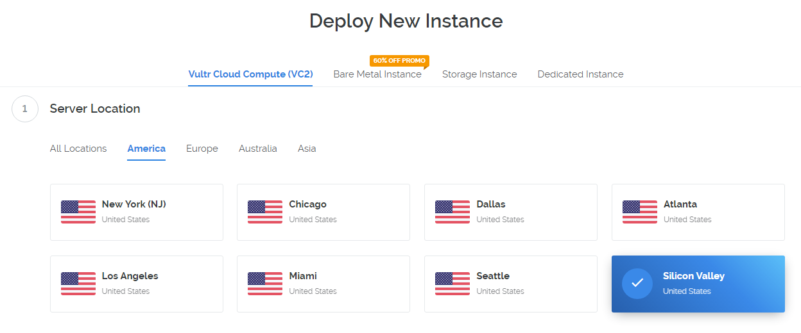
***

***Step 4***
* Choose a server type: Ubuntu 16.04

***

***Step 5***
* Choose a server size: $5/mo will be fine

***

***Step 6***
* Set a Server Hostname & Label (name it whatever you want)

***

***Step 7***
* Click "Deploy now"

***

## Section B: Downloading and installing BitVise.

***Step 1***
* Download Bitvise [here](https://dl.bitvise.com/BvSshClient-Inst.exe)
***

***Step 2***
* Select the correct installer depending upon your operating system. Then follow the install instructions.

***

## Section C: Connecting to the VPS & Installing the MN script via Bitvise.

***Step 1***
* Copy your VPS IP (you can find this by going to the server tab within Vultr and clicking on your server.

***

***Step 2***
* Open the bitvise application and fill in the "Hostname" box with the IP of your VPS then click "Login"

***

***Step 3***
* Once you have clicked open it will open a security alert (click "Accept and Save").  
***

***Step 4***
* Type "root" as the login/username then press enter

***

***Step 5***
* Copy the root password from the VULTR server page.
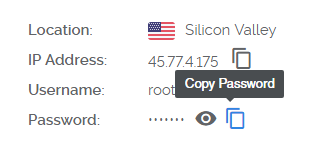

***

***Step 6***
* Paste the password into the Bitvise terminal by right clicking (it will not show the password so just press enter)
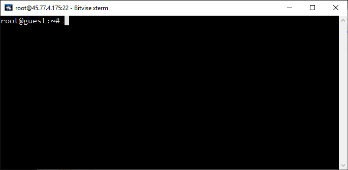
***

***Step 7***
* Paste the code below into the Bitvise terminal then press enter (it will just go to a new line)

`wget -q https://github.com/c2fcoin/c2fcoin/raw/master/doc/masternode-install.sh`
***

***Step 8***
* Paste the code below into the Bitvise terminal then press enter

`bash masternode-install.sh`

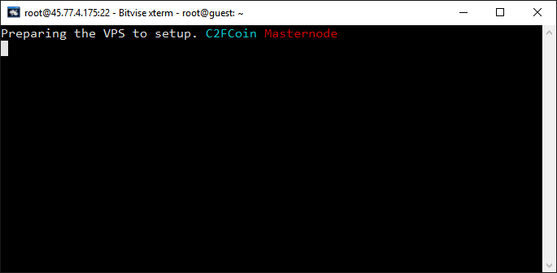

***

***Step 9***
* Sit back and wait for the install (this will take a couple of minutes)
***

***Step 10***
* When prompted to enter your GEN Key - press enter

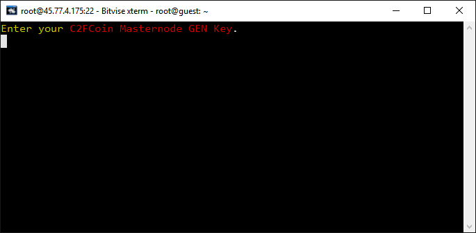

* Your C2FCoin server instance will start shortly

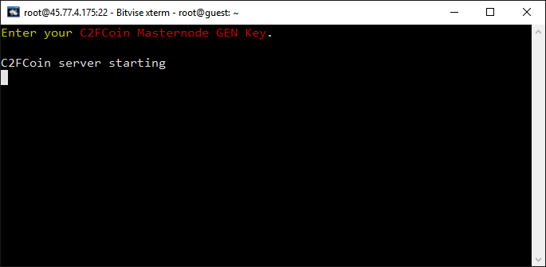
***

***Step 11***
* You will now see all of the relevant information for your server.
* Keep this terminal open as we will need the info for the wallet setup.
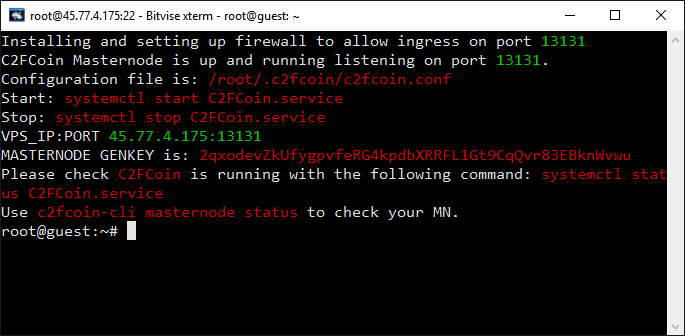
***

## Section D: Preparing the Local wallet

***Step 1***
* Download and install on the local PC the C2FCoin wallet from [here](https://github.com/c2fcoin/c2fcoin/releases/latest)
***

***Step 2***
* Send EXACTLY 1000 C2F to a receive address within your wallet.
***

***Step 3***
* Create a text document to temporarily store information that you will need.
***

***step 4***
* Open Tools -> Debug console within the wallet

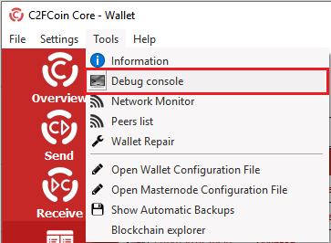
***

***Step 5***
* Type the command below and press enter

`masternode outputs`

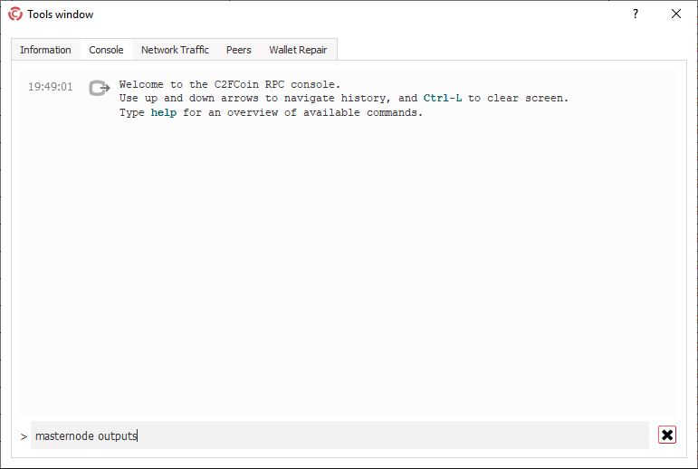
***

***Step 6***
* Copy the long key (this is your transaction ID) and the 0 or 1 at the end (this is your output index)
* Paste these into the text document you created earlier as you will need them in the next step.
***

# Section E: Connecting & Starting the masternode

***Step 1***
* Go to the Tools tab within the wallet and click "Open Masternode Configuration File"
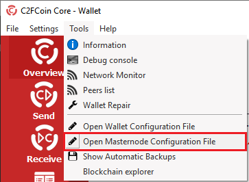
***

***Step 2***

* Fill in the form.
* For `Alias` type something like "MN1" **don't use spaces**
* The `Address` is the IP and port of your server (this will be in the Bitvise terminal that you still have open); make sure the port is set to **13131**.
* The `Genkey` is your masternode Gen key output (this is also in the Bitvise terminal that you have open).
* The `TxHash` is the transaction ID/long key that you copied to the text file.
* The `Output Index` is the 0 or 1 that you copied to your text file.

Click "File Save"
***

***Step 3***
* Close out of the wallet and reopen Wallet
* Click on the Masternodes tab
* Select your masternode, right click and select Start alias
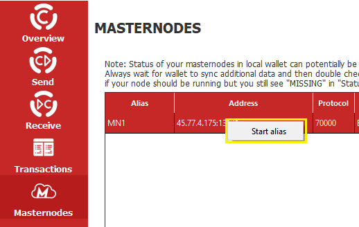
***

***Step 4***
* Check the status of your masternode within the VPS by using the command below:

`c2fcoin-cli masternode status`

*You should see ***status 4***

If you do, congratulations! You have now setup a masternode. If you do not, please contact [support](https://discord.gg/BBBms9Z) and they will assist you.  
***
